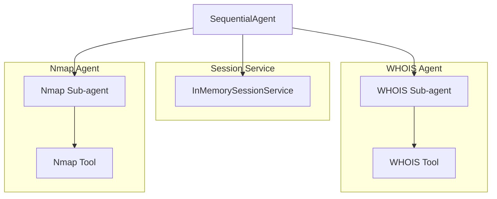

# Problem
During a penetration test, various steps must be performed by a pen tester. The first step is reconnaissance, followed by scanning, vulnerability scanning and exploitation. So these are the four steps in general. It is a very intense process as most pen testers are given a short time to complete the assignment and they can only do it after office hours. 

I think this is a important problem to solve as it is not easy to employ experienced pen testers and we have been trying to automate pen testing way before AI became so popular. In fact one scanning tool employ neural network to help identify the web server that was scanned. Knowing with confidence the web server used and its version helps in the exploitation step as the correct exploits can be used to attack the web server to gain access. 

Here I will attempt to create an AI agent to perform the reconnaissance step using WHOIS and the scanning step using Nmap port scanner.

 
# Solution
AI agents are uniquely suitable for this task as pen testting is a task that requires analysis at each step and the results obtained at each step will affect what we will do at the next step. Agents can tap the analytical and thinking power of a LLM for the task. Agents can also make use of tools to perform the actual steps like port scanning. MCP servers can be and should be developed for pen testting. 
 
# Architecture

 
# Instructions for setup
It is easy. Just source setup.sh
source setup.sh
